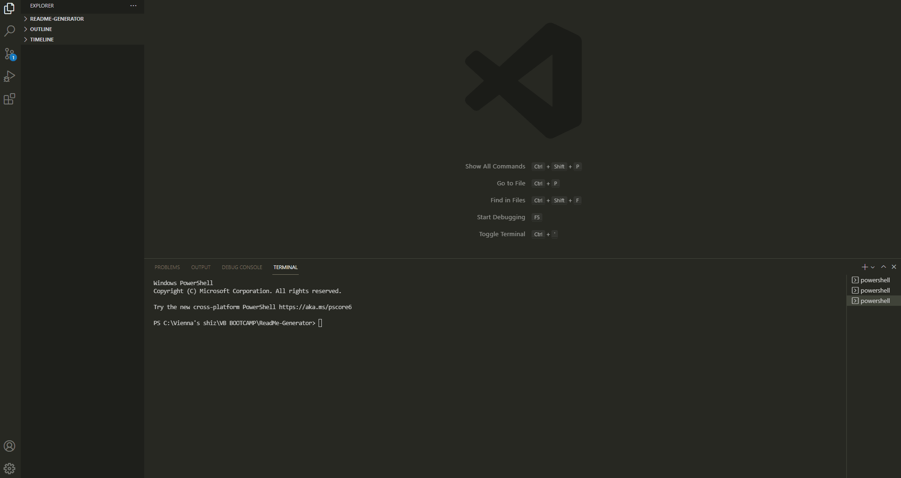

# README GENERATOR

## Description

This is a project to build a CLI which prompts user imput with a series of questions, and generates a high-quality, professional README file.

WARNING!
Once a README file has been generated, the program will automatically overwrite this if the application is re-run, so if multiple generations are needed please ensure files are renamed/moved before the next file is generated.

## LANGUAGE : JavaScript

## TOOLS : Node.js

## FILES

- Assets > Project-Demo.gif - demonstration video
- My-README > folder for generated README files (contains SAMPLE-README.md - a sample of a README file generated by the program)
- utils > generateMarkdown.js - functions to render license information and README layout.
- index.js - modules, packages, questions & writing to file
- package-lock.json - node modules tree visiblity
- package.json - node.js metadata
- README.md - project information
- SAMPLE-README.md - sample of a README generated using the program.

## Table of Contents

- [Installation](#installation)
- [Usage](#usage)
- [Contributing](#contributing)
- [Tests](#tests)
- [Questions](#questions)

## Installation

The user should clone the repository from GitHub and run in a code editor terminal using Node. Run 'npm install' before using to make sure all required modules/packages are installed.

## Usage

Answer questions about your project when prompted in the command line to generate a README file.

## Contributing

Contributors should refer to the installation section. Future contributors should make a new branch and push any changes to be reviewed. Please do not push to the main branch.

## Tests

No tests written for this project.

## Questions

If you have any questions about this projects, please contact me directly at viennabdev@gmail.com. You can view more of my projects at https://github.com/ViennaBorowska.
